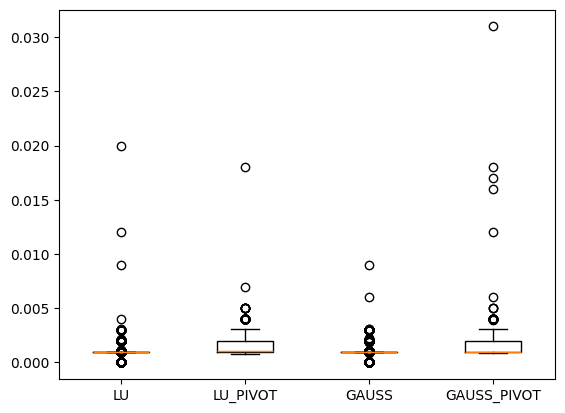
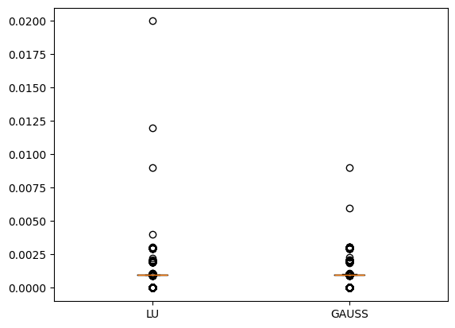

# Sprawozdanie 2 - Eliminacja Gaussa i LU faktoryzacja

# Wojciech Smolarczyk, Wiktoria Zalińska

## Eliminacja Gaussa

Eliminacja Gaussa to klasyczny algorytm stosowany do rozwiązywania układów równań liniowych **Ax = b**. Celem algorytmu jest przekształcenie macierzy **A** do formy górnotrójkątnej poprzez operacje eliminacyjne, a następnie rozwiązanie układu równań za pomocą podstawiania wstecz.

### **Kroki eliminacji Gaussa bez pivotingu:**

1. **Inicjalizacja**:

   - Macierz **A** i wektor **b** są kopiowane i przygotowywane do dalszych obliczeń.

2. **Eliminacja**:

   - Dla każdej kolumny, eliminowane są elementy pod przekątną, aby przekształcić macierz do formy górnotrójkątnej.
   - Przez każdą iterację dzielimy elementy wierszy przez element przekątnej, aby uzyskać jedynki na przekątnej.

3. **Rozwiązanie układu równań**:
   - Po zakończeniu eliminacji macierz **A** jest już w formie górnotrójkątnej. Rozwiązanie układu uzyskujemy za pomocą podstawiania wstecz.

---

## **Kod implementacji eliminacji Gaussa bez pivotingu**

```python
def gauss_elimination_no_pivoting(A, b):
    """
    Rozwiązuje układ równań Ax = b za pomocą eliminacji Gaussa bez pivotingu,
    generując jedynki na przekątnej.

    Parametry:
    A -- macierz współczynników (n x n)
    b -- wektor prawych stron (n)

    Zwraca:
    x -- wektor rozwiązania
    """
    n = len(A)
    A = np.array(
        A, dtype=float
    )  # Konwersja na float, aby uniknąć dzielenia całkowitego
    b = np.array(b, dtype=float)

    # --- Eliminacja współczynników pod przekątną ---
    for k in range(n - 1):  # Dla każdej kolumny (oprócz ostatniej)
        for i in range(k + 1, n):  # Dla każdego wiersza poniżej przekątnej
            if A[k, k] == 0:
                raise ZeroDivisionError(
                    "Wystąpiło dzielenie przez zero. Użyj pivotingu!"
                )
            factor = A[i, k] / A[k, k]
            A[i, k:] -= factor * A[k, k:]  # Aktualizacja wiersza i-tego
            b[i] -= factor * b[k]

    # --- Normalizacja, aby uzyskać jedynki na przekątnej ---
    for k in range(n):
        divisor = A[k, k]
        if divisor == 0:
            raise ZeroDivisionError("Macierz osobliwa - brak rozwiązania!")
        A[k, k:] /= divisor  # Normalizacja wiersza
        b[k] /= divisor

    # --- Rozwiązanie układu równań (wsteczna substytucja) ---
    x = np.zeros(n)
    for i in range(n - 1, -1, -1):
        x[i] = b[i] - np.dot(A[i, i + 1 :], x[i + 1 :])

    return x
```

---

### **Eliminacja Gaussa z pivotingiem**

Pivoting to technika poprawiająca stabilność numeryczną, szczególnie gdy występują małe lub zerowe elementy na przekątnej macierzy **A**. Dzięki pivotingowi unikamy dzielenia przez zero lub przez bardzo małe liczby, co mogłoby prowadzić do błędów numerycznych.

#### **Kroki eliminacji Gaussa z pivotingiem**:

1. **Inicjalizacja**:

   - Podobnie jak w klasycznej eliminacji Gaussa, zaczynamy od przygotowania macierzy **A** i wektora **b**.

2. **Pivoting – zamiana wierszy**:

   - W każdej iteracji wybieramy największy element w kolumnie (od bieżącego wiersza w dół) i zamieniamy wiersze, aby mieć większy element na przekątnej. To poprawia stabilność obliczeń.

3. **Eliminacja**:

   - Następnie przeprowadzamy standardową eliminację Gaussa, aby macierz **A** przyjęła formę górnotrójkątną.

4. **Rozwiązanie układu równań**:
   - Po zakończeniu eliminacji rozwiązujemy układ równań za pomocą podstawiania wstecz.

---

## **Kod implementacji eliminacji Gaussa z pivotingiem**

```python
def gauss_elimination_pivoting(A, b):
    """
    Rozwiązuje układ równań Ax = b za pomocą eliminacji Gaussa z częściowym pivotingiem.

    Parametry:
    A -- macierz współczynników (n x n)
    b -- wektor prawych stron (n)

    Zwraca:
    x -- wektor rozwiązania
    """
    n = len(A)
    A = np.array(A, dtype=float)
    b = np.array(b, dtype=float)

    for k in range(n - 1):
        # --- Częściowy pivoting: wybór wiersza z maksymalnym elementem w kolumnie k ---
        max_row = (
            np.argmax(np.abs(A[k:, k])) + k
        )  # Indeks wiersza z maksymalną wartością |A[i,k]|
        if A[max_row, k] == 0:
            raise ValueError("Macierz osobliwa - brak rozwiązania!")

        # Zamiana wierszy, jeśli konieczne
        if max_row != k:
            A[[k, max_row]] = A[[max_row, k]]  # Zamiana wierszy w A
            b[k], b[max_row] = b[max_row], b[k]  # Zamiana elementów w b

        # --- Eliminacja współczynników pod przekątną ---
        for i in range(k + 1, n):
            factor = A[i, k] / A[k, k]
            A[i, k:] -= factor * A[k, k:]
            b[i] -= factor * b[k]

    # --- Rozwiązanie układu równań (wsteczna substytucja) ---
    x = np.zeros(n)
    for i in range(n - 1, -1, -1):
        if A[i, i] == 0:
            raise ValueError("Macierz osobliwa - brak rozwiązania!")
        x[i] = (b[i] - np.dot(A[i, i + 1 :], x[i + 1 :])) / A[i, i]

    return x
```

---

## LU faktoryzacja

Algorytm LU faktoryzacji polega na rozłożeniu macierzy kwadratowej na iloczyn dwóch macierzy:

<center>A = LU</center>

gdzie:

- **L** – macierz dolnotrójkątna (z jedynkami na przekątnej),
- **U** – macierz górnotrójkątna.

Główna zaleta LU faktoryzacji to możliwość szybszego rozwiązania układów równań liniowych.  
Zamiast rozwiązywać **Ax = b** bezpośrednio, dzielimy problem na dwa prostsze układy:

<center>LC = b</center>
<center>Ux = c</center>

Najpierw rozwiązujemy **Lc = b**, a następnie **Ux = c** metodą podstawiania.

---

### **Kroki LU faktoryzacji**

1. **Inicjalizacja**:

   - Tworzymy macierz dolnotrójkątną **L** jako macierz jednostkową.
   - Kopiujemy **A** do **U**, ponieważ będziemy ją modyfikować.

2. **Eliminacja Gaussa**:

   - Dla każdej kolumny eliminujemy elementy pod przekątną, zapisując współczynniki eliminacji w macierzy **L**.

3. **Wynik**:
   - **U** staje się macierzą górnotrójkątną.
   - **L** zawiera współczynniki eliminacji poniżej przekątnej oraz jedynki na przekątnej.

---

## LU faktoryzacja z pivotingiem

LU faktoryzacja z pivotingiem jest ulepszoną wersją LU, która poprawia stabilność numeryczną i pozwala uniknąć dzielenia przez małe wartości (lub zero) na przekątnej.  
Wprowadza dodatkową macierz permutacji **P**, która zapisuje zamiany wierszy.

Dzięki temu zamiast rozwiązywać:

<center>Ax = B</center>

rozwiązujemy:

<center>PAx = Pb</center>

gdzie P rejestruje kolejność zamian wierszy.

---

### **Kroki LU faktoryzacji z pivotingiem**

1. **Inicjalizacja**:

   - Tworzymy **P** jako macierz jednostkową.
   - Tworzymy **L** jako macierz jednostkową.
   - Kopiujemy **A** do **U**.

2. **Pivoting – zamiana wierszy**:

   - W każdej iteracji wybieramy największy element w kolumnie (od aktualnego wiersza w dół).
   - Zamieniamy odpowiednie wiersze macierzy U, P i L (w L zamieniamy tylko wcześniejsze kolumny).

3. **Eliminacja Gaussa** (tak jak w zwykłym LU).

---

## **Kod implementacji LU z i bez pivotingu**

```python
def lu_decomposition(A, pivoting=False):
    n = A.shape[0]
    # Macierz permutacyjna – początkowo jednostkowa
    P = np.eye(n)
    # Macierz dolnotrójkątna – początkowo jednostkowa
    L = np.eye(n)
    # Kopia A, bo będziemy modyfikować U
    U = A.copy()

    for i in range(n):
        if pivoting:
            # Znalezienie indeksu największego elementu w aktualnej kolumnie poniżej przekątnej
            max_index = np.argmax(abs(U[i:, i])) + i

            # Zamiana wierszy
            if max_index != i:
                U[[i, max_index]] = U[[max_index, i]]
                P[[i, max_index]] = P[[max_index, i]]
                if i > 0:  # Zamiana tylko wcześniejszych kolumn w L
                    L[[i, max_index], :i] = L[[max_index, i], :i]

        for j in range(i+1, n):
            # Obliczenie współczynnika eliminacji
            L[j, i] = U[j, i] / U[i, i]
            # Aktualizacja macierzy U
            U[j, i:] -= L[j, i] * U[i, i:]

    if pivoting:
        return P, L, U
    else:
        return L, U
```

## **Kod rozwiązanie układu równań przy użyciu LU**

```python
def solve_lu(A, b, pivoting=False):
    if pivoting:
        P, L, U, b = lu_decomposition(A, b, pivoting=True)
    else:
        L, U, b = lu_decomposition(A, b, pivoting=False)

    # Rozwiązanie Lc = b (podstawianie w przód)
    n = len(b)
    c = np.zeros(n)
    for i in range(n):
        c[i] = b[i] - np.dot(L[i, :i], c[:i])

    # Rozwiązanie Ux = c (podstawianie wstecz)
    x = np.zeros(n)
    for i in range(n-1, -1, -1):
        x[i] = (c[i] - np.dot(U[i, i+1:], x[i+1:])) / U[i, i]

    return x
```

## **Przykładowe rozwiąznie**

```python
import random

random.seed(11)
N = 24


A = np.random.rand(N, N)
print(A)

b = np.random.rand(N)

print(b)
```

```python


import time


times = {}


for method in [
    "gauss_no_pivoting",
    "gauss_pivoting",
    "lu_decomposition",
    "lu_decomposition_pivoting",
]:

    if method == "gauss_no_pivoting":
        start_time = time.time()
        result = gauss_elimination_no_pivoting(A, b)
        end_time = time.time()

    elif method == "gauss_pivoting":
        start_time = time.time()
        result = gauss_elimination_pivoting(A, b)
        end_time = time.time()

    elif method == "lu_decomposition":
        start_time = time.time()
        result = solve_lu(A, b, pivoting=False)
        end_time = time.time()

    elif method == "lu_decomposition_pivoting":
        start_time = time.time()
        result = solve_lu(A, b, pivoting=True)
        end_time = time.time()
    print(f"Result of {method} is:\n {result}\n")

    times[method] = end_time - start_time


```

Result of gauss_no_pivoting is: \
[ 6.03539442 -9.51381137 -0.32276799 1.24029809 13.20661727 2.00987153 \
-5.39275068 -6.07083725 10.73726739 4.21583045 -4.94655828 -7.32216311 \
5.88480083 -5.64277448 -6.43851531 -0.18732226 10.72923575 -5.36230062 \
-6.53364338 -5.78166517 -1.87389013 0.40042126 12.09947536 1.40348178]

Result of gauss_pivoting is: \
[ 6.03539442 -9.51381137 -0.32276799 1.24029809 13.20661727 2.00987153 \
-5.39275068 -6.07083725 10.73726739 4.21583045 -4.94655828 -7.32216311 \
5.88480083 -5.64277448 -6.43851531 -0.18732226 10.72923575 -5.36230062 \
-6.53364338 -5.78166517 -1.87389013 0.40042126 12.09947536 1.40348178]

Result of lu_decomposition is: \
[ 6.03539442 -9.51381137 -0.32276799 1.24029809 13.20661727 2.00987153 \
-5.39275068 -6.07083725 10.73726739 4.21583045 -4.94655828 -7.32216311 \
5.88480083 -5.64277448 -6.43851531 -0.18732226 10.72923575 -5.36230062 \
-6.53364338 -5.78166517 -1.87389013 0.40042126 12.09947536 1.40348178]

Result of lu_decomposition_pivoting is: \
[ 6.03539442 -9.51381137 -0.32276799 1.24029809 13.20661727 2.00987153 \
-5.39275068 -6.07083725 10.73726739 4.21583045 -4.94655828 -7.32216311 \
5.88480083 -5.64277448 -6.43851531 -0.18732226 10.72923575 -5.36230062 \
-6.53364338 -5.78166517 -1.87389013 0.40042126 12.09947536 1.40348178]

---

## Porównanie czasów wykonania dla różnych metod rozwiązania układu równań

Poniżej przedstawiona jest tabela z czasami wykonania różnych metod rozwiązania układu równań dla macierzy o rozmiarze 24x24:

| Metoda                          | Czas wykonania [s] |
| ------------------------------- | ------------------ |
| Eliminacja Gaussa bez pivotingu | 0.001209           |
| Eliminacja Gaussa z pivotingiem | 0.001705           |
| LU faktoryzacja bez pivotingu   | 0.000792           |
| LU faktoryzacja z pivotingiem   | 0.001252           |

**Najbardziej efektywna metoda**: LU faktoryzacja bez pivotingu wykazała się najszybszym czasem wykonania, co sugeruje, że dla macierzy o rozmiarze 24x24 ta metoda jest optymalna pod względem wydajności.

**Metody z pivotingiem**: Wprowadzenie pivotingu w obu metodach wydłużyło czas wykonania, co jest wynikiem dodatkowych operacji związanych z zamianą wierszy, jednak poprawia stabilność numeryczną rozwiązania.

## Anliza większej liczby przypadków





Powyższe boxploty pokazują, że czas zliczany wielokrotnie dla każdego z algorytmów rzeczywiście ukazją, że LU jest najszybszym z algorytmów choć różnica pomiędzy nim a Gaussem nie jest aż tak znacząca. Algortymy z pivotem już relatywnie odstają od swoich odpowiedników ale oczywiście koszt czasowy jest równoważony stabilnością numeryczną.
