# Sprawozdanie 5 - Metoda potęgowa

# Wojciech Smolarczyk, Wiktoria Zalińska

## Wstęp

W matematyce iteracja potęgowa (znana również jako metoda potęgowa) jest algorytmem wartości własnych: biorąc pod uwagę macierz diagonalizowalną
`A` algorytm wygeneruje liczbę `λ` która jest największą (w wartości bezwzględnej) wartością własną `A` i wektor różny od zera `v`, który jest odpowiadającym wektorem własnym λ ,czyli:
Av=λv

Algorytm ten jest również znany jako iteracja von Misesa od nazwiska austriackiego matematyka i fliozofa Richard Martin Edler von Mises twórcy m.in.: hipotezę wytężenia materiału.

Chociaż metoda iteracji potęgowej przybliża tylko jedną wartość własną macierzy, pozostaje ona użyteczna w przypadku pewnych problemów obliczeniowych. Na przykład Google używa jej do obliczania PageRank dokumentów w swojej wyszukiwarce, a Twitter używa jej do wyświetlania użytkownikom rekomendacji, kogo obserwować.

## 1. Implementacja metody potęgowej

Celem zadania było zaimplementowanie **metody potęgowej** dla macierzy `3x3` w celu wyznaczenia największej wartości własnej oraz odpowiadającego jej wektora własnego. W algorytmie uwzględniono warunki dotyczące losowania wektora początkowego oraz kryterium błędu początkowego.

Metoda potęgowa to prosta i skuteczna iteracyjna metoda numeryczna służąca do wyznaczenia największej (co do wartości bezwzględnej) wartości własnej macierzy kwadratowej `A`, oraz odpowiadającego jej wektora własnego `z`.

### Kroki algorytmu:

1. Znalezienie wektora startowego:

- Generacja losowego wektora z z przedziału (0,1).

- Obliczenie:

  - **w=Az**,

  - $\lambda = max(|w|)$,

  - $error = ||Az - \lambda * z||$

- Jeżeli $error < 10^{-8}$, to powtarzane są powyższe kroki (aby nie startować z wektora, który spełnia warunki stopu)

2. Iteracja:

- obliczenie **w=Az**

- $\lambda = max(|w|)$

- nowe z jako $z = w / \lambda$

- $error = ||Az - \lambda * z||$

Jeżeli $error < 10^{-8}$, kończymy iterację, otrzymując największą wartość własną i odpowiadający jej wektor własny.

### Kod algorytmu

```python
def power_method(A, p=2, epsilon=1e-8, max_iter=1000):

    n = A.shape[0]

    while True:
        # Generate a random 3x1 vector
        z = np.random.uniform(0.0, 1.0, n)

        # Calculate the product of A and z
        w = np.dot(A, z)

        # Calculate error
        lambda_ = np.max(np.abs(w))
        error = np.linalg.norm(w - lambda_ * z, ord=p)

        if error >= epsilon: # z is ok -> don't start froma vector that meets the stop condition
            break


    for i in range(max_iter):
        w = np.dot(A, z)
        lambda_ = np.max(np.abs(w))
        z = w / lambda_

        error = np.linalg.norm(A @ z - lambda_ * z, ord=p)


        if error < epsilon:
            break

    return lambda_, z, i+i, error
```

### Wynik działania programu

- Matrix A:

[[5 2 8]

[3 4 2]

[8 6 2]]

- Największa wartość własna: 13.62590694760338

- Odpowiadający wektor własny: [1. 0.50923604 0.95092936]

- Liczba iteracji: 40

- Końcowy błąd: 6.578052208635384e-09

- Iloczyn A z:

array([13.62590694, 6.93880287, 12.95727495])

- Iloczyn lambda z:

array([13.62590695, 6.93880287, 12.95727495])

## Rozkład SVD macierzy 3x3 z wykorzystaniem metody potęgowej

W celu wyznaczenia wektorów i wartości własnych macierzy $AA^T$, wartości i wektory własne obliczamy za pomocą metody potęgowej - aby znaleźć kolejną wartość, dokonujemy deflacji macierzy zgodnie ze wzorem:

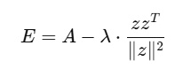

i dla niej stosujemy kolejny raz metodę potęgową.

W wyniku otrzymujemy:

- macierz U - zawierającą wektory własne

- macierz D - zawierającą wartości osobliwe

Macierz V obliczamy jako:
$V=A^TUinv(D)$
(przy czym macierz D jest diagonalna taka że $inv(D)_{ii} = 1/D_{ii}$)

W wyniku czego uzyskujemy zrekonstruowaną macierz A:

$A_{rec} = U  D V^T$

### Kod:

```python

AAT = np.dot(A, A.T)
B = AAT.copy()

eigenvalues = []
eigenvectors = []

# Calculate eigenvalues and eigenvectors of AAT
for i in range(3):
    lambda_, eigenvector_, _, _ = power_method(B)
    eigenvalues.append(lambda_)
    eigenvectors.append(eigenvector_)

    # deflate
    B = B - lambda_ * np.outer(eigenvector_, eigenvector_) / np.dot(eigenvector_, eigenvector_)

# Normalize eigenvectors
for i in range(len(eigenvectors)):
    eigenvectors[i] = eigenvectors[i] / np.linalg.norm(eigenvectors[i])

# Matrix U — wektory własne
U = np.column_stack(eigenvectors)

# Matrix D - pierwiastki z wartości własnych
D_vals = np.sqrt(np.array(eigenvalues))
D = np.diag(D_vals)

# Inverse D
D_inv = np.diag([1 / d if d > 1e-12 else 0 for d in D_vals])

V = A.T @ U @ D_inv

A_reconstructed = U @ D @ V.T
```

### Wyniki:

Macierz A:

[[5 2 8]

[3 4 2]

[8 6 2]]

Macierz U:

[[ 0.61918806 0.78051443 -0.0860428 ]

[ 0.3685361 -0.19209505 0.90954969]

[ 0.69338827 -0.59489218 -0.40659071]]

Macierz D:

[[13.86943642 0. 0. ]

[ 0. 5.61901815 0. ]

[ 0. 0. 1.437139 ]]

Macierz V:

[[ 0.70288759 -0.25500014 -0.66402106]

[ 0.49553925 -0.49416185 0.7143143 ]

[ 0.51028412 0.83113115 0.22097765]]

Odtworzona macierz A:

[[5. 2. 8.]

[3. 4. 2.]

[8. 6. 2.]]

## Zadanie 3

Proszę porównać wykresy zbieżności algorytmu metody potęgowej dla 3 wektorów i wartości
własnych, dla różnych norm ||.||p gdzie p=1,2,3,4 oraz dla normy nieskończoność, używając
dokładności epsilon = 0.0001
Proszę wygenerować 5\*3=15 wykresów. Na każdym wykresie narysować: oś pozioma – iteracje,
oś pionowa – błąd (error policzony jak w punkcie b)

```python
epsilon = 0.0001
vectors = [
    np.random.uniform(0.0, 1.0, 3),
    np.random.uniform(0.0, 1.0, 3),
    np.random.uniform(0.0, 1.0, 3),
]
iterations = 1000

for vector in vectors:
    errors = []

    z = vector

    for i in range(iterations):
        w = np.dot(A, z)
        lambda_ = np.max(np.abs(w))
        z = w / lambda_

        error = np.linalg.norm(A @ z - lambda_ * z, ord=1)
        errors.append(error)
        if error < epsilon:
            break

    plt.title(f"Błędy dla normy 1 dla startowego wektora {vector}")
    plt.plot(errors, linestyle="dotted")
    plt.show()


for vector in vectors:
    errors = []

    z = vector

    for i in range(iterations):
        w = np.dot(A, z)
        lambda_ = np.max(np.abs(w))
        z = w / lambda_

        error = np.linalg.norm(A @ z - lambda_ * z, ord=np.inf)
        errors.append(error)
        if error < epsilon:
            break

    plt.title(f"Błędy dla normy INF dla startowego wektora {vector}")
    plt.plot(errors, linestyle="dotted")
    plt.show()

for vector in vectors:
    errors = []

    z = vector

    for i in range(iterations):
        w = np.dot(A, z)
        lambda_ = np.max(np.abs(w))
        z = w / lambda_

        error = np.linalg.norm(A @ z - lambda_ * z, ord=2)
        errors.append(error)
        if error < epsilon:
            break

    plt.title(f"Błędy dla normy 2 dla startowego wektora {vector}")
    plt.plot(errors, linestyle="dotted")
    plt.show()

for vector in vectors:
    errors = []

    z = vector

    for i in range(iterations):
        w = np.dot(A, z)
        lambda_ = np.max(np.abs(w))
        z = w / lambda_

        error = matrix_norm_p(A @ z - lambda_ * z, 3)
        errors.append(error)
        if error < epsilon:
            break

    plt.title(f"Błędy dla normy 3 dla startowego wektora {vector}")
    plt.plot(errors, linestyle="dotted")
    plt.show()


for vector in vectors:
    errors = []

    z = vector

    for i in range(iterations):
        w = np.dot(A, z)
        lambda_ = np.max(np.abs(w))
        z = w / lambda_

        error = matrix_norm_p(A @ z - lambda_ * z, 4)
        errors.append(error)
        if error < epsilon:
            break

    plt.title(f"Błędy dla normy 4 dla startowego wektora {vector}")
    plt.plot(errors, linestyle="dotted")
    plt.show()
```

Dla wektora [0.18151791, 0.52310778, 0.64263515]:

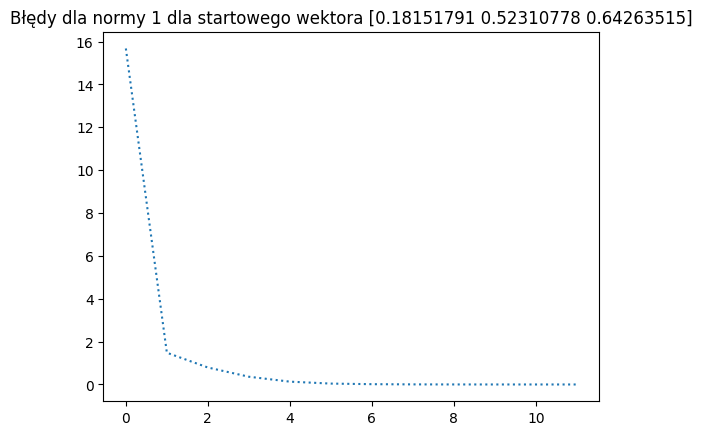

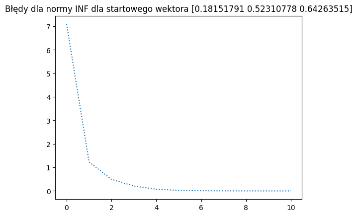

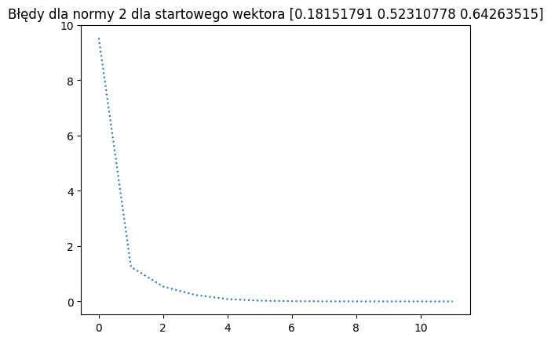

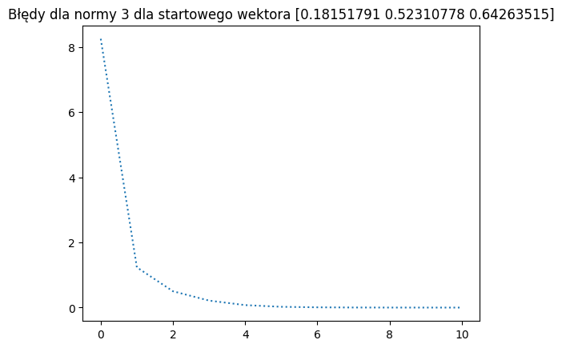

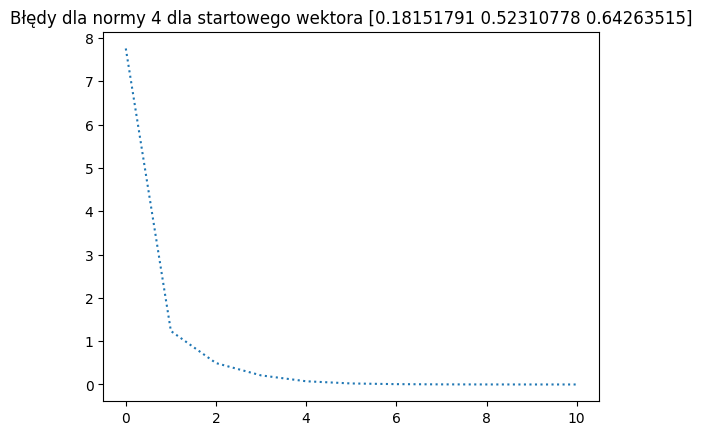

Dla wektora [0.5593644 , 0.61109228, 0.70377718]:

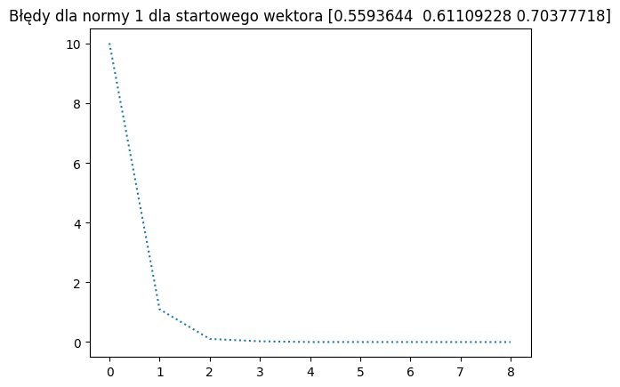

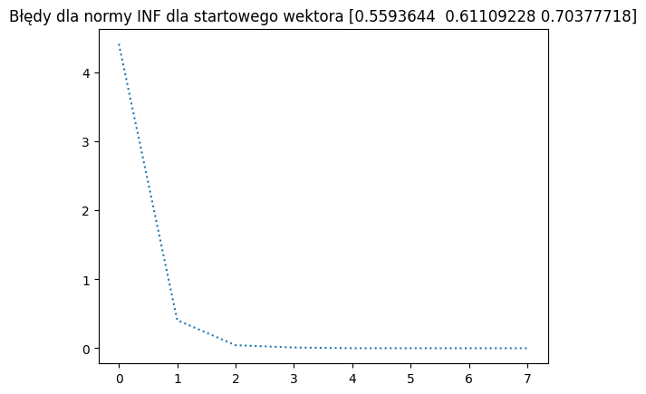

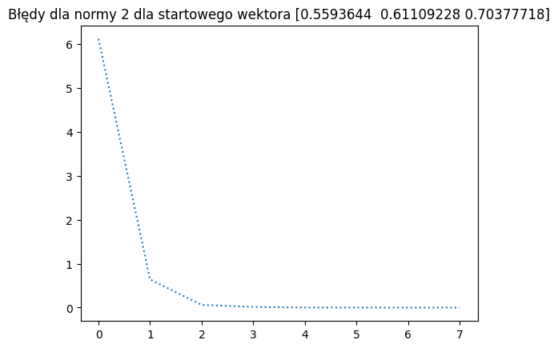

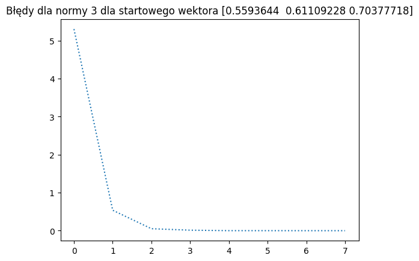


Dla wektora [0.14339506, 0.97453851, 0.33250533]:

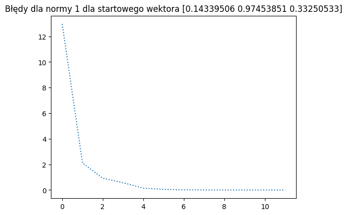

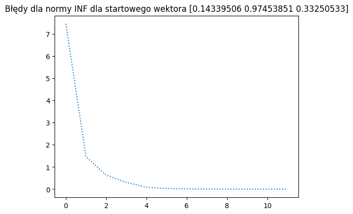


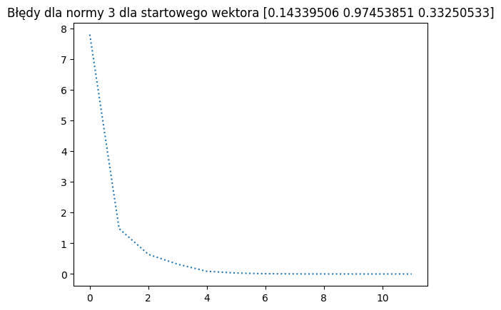


Wniosek:

Kluczowym dla szybkości zmiejszania się błędu jest dobry wybór wektora W początkowego. Norma nie ma widocznych (ma minimalny) wpływ na szybkość zmniejszania się błędu.

## Zadanie 4

Proszę policzyć SVD macierzy A używając biblioteki numerycznej i porównać dokładność oszacowaną jako ||UDV - SVD(A)||p.

```python
U, D, Vt = np.linalg.svd(A)

# Zrekonstruuj macierz A jako U @ diag(D) @ Vt
A_reconstructed = U @ np.diag(D) @ Vt

# Oblicz normy różnicy ||A - A_reconstructed||_p

norm_2 = np.linalg.norm(A - A_reconstructed, 2)
norm_1 = np.linalg.norm(A - A_reconstructed, 1)
norm_inf = np.linalg.norm(A - A_reconstructed, np.inf)

print("Oryginalna macierz A:")
print(A)
print("\nZrekonstruowana macierz U @ diag(D) @ Vt:")
print(A_reconstructed)
print("\nNormy różnicy ||A - UDVt||_p:")

print(f"Norma spektralna (2): {norm_2}")
print(f"Norma kolumnowa (1): {norm_1}")
print(f"Norma nieskonczona (1): {norm_inf}")
```

Oryginalna macierz A:
[[5 2 8]
 [3 4 2]
 [8 6 2]]

Zrekonstruowana macierz U @ diag(D) @ Vt:
[[5. 2. 8.]
 [3. 4. 2.]
 [8. 6. 2.]]

Normy różnicy ||A - UDVt||\_p:

Norma spektralna (2): 1.0253185603527865e-14

Norma kolumnowa (1): 1.199040866595169e-14

Norma nieskonczona : 1.3322676295501878e-14

Wniosek: Różnica między zrekonstruowaną a prawdzią macierzą jest minimalny bezwzglęu na użytą normę.
